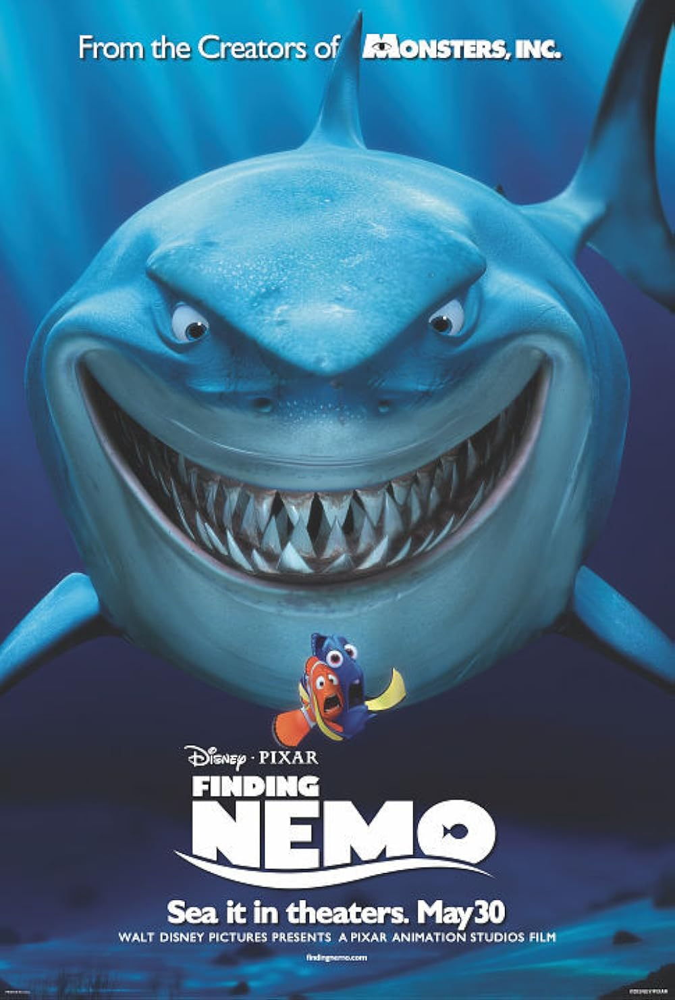
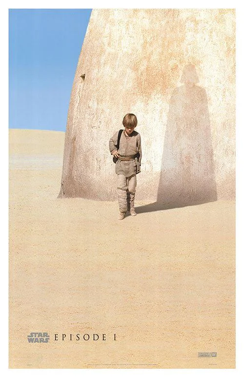
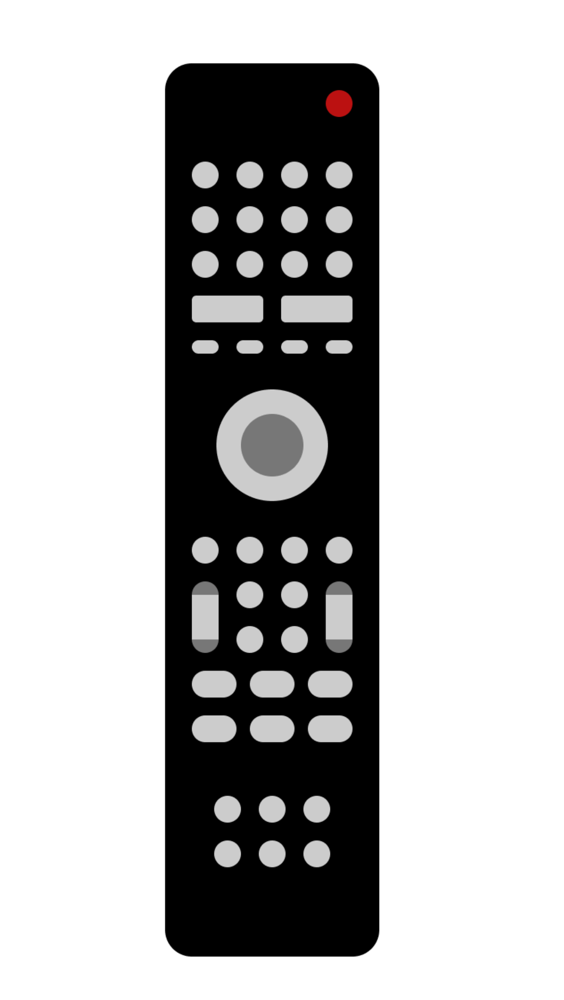
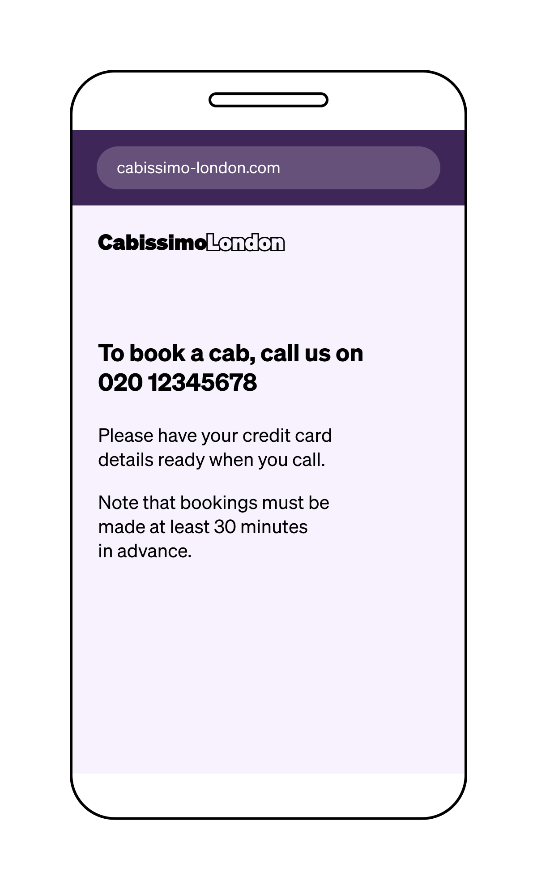
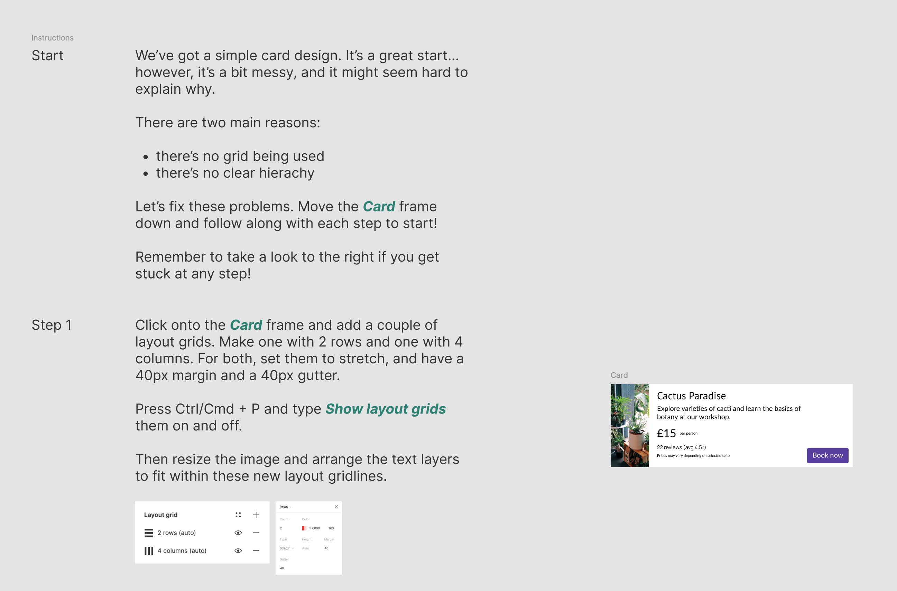

# Paper and Pen

> Paper and pen challenges to showcase your existing skills

<!-- START doctoc generated TOC please keep comment here to allow auto update -->
<!-- DON'T EDIT THIS SECTION, INSTEAD RE-RUN doctoc TO UPDATE -->
**Table of Contents**

- [🐣 Introduction](#-introduction)
- [🥾 Challenge 0 - Start Sketching](#%F0%9F%A5%BE-challenge-0---start-sketching)
  - [Sketch 20 objects - 20 minutes](#sketch-20-objects---20-minutes)
  - [Sketch 5 posters - 5 minutes per poster](#sketch-5-posters---5-minutes-per-poster)
- [🎤 Challenge 1 - Express yourself with words](#-challenge-1---express-yourself-with-words)
  - [Catchline - 5 minutes](#catchline---5-minutes)
  - [Logo redesign - 10 minutes](#logo-redesign---10-minutes)
- [🎛️ Challenge 2 - Usability](#-challenge-2---usability)
  - [Remote control - 15 min](#remote-control---15-min)
  - [Book and call a cab - 15 min](#book-and-call-a-cab---15-min)
- [🎨 Challenge 3 - Design for the first time with Figma](#-challenge-3---design-for-the-first-time-with-figma)

<!-- END doctoc generated TOC please keep comment here to allow auto update -->

## 🐣 Introduction

Being a web actor as designer or programmer is all about **non-designing skills and non-programming skills** as empathy, communication, patience, innovation and adaptability.

These following challenges will challenge your

1. **Problem Solving** -  How do you break a problem into smaller ones.
2. **Creativity** - How do you optimize solution with creativity.
3. **Value of effort** - How do you persevere to find the solution.

For each challenge, follow the steps instructions and **use only paper and pen**.

## 🥾 Challenge 0 - Start Sketching

You don't need to have studied "Les Beaux Arts" to be a great designer, but basic drawing is an important skill.
Drawing allows you to quickly explore ideas and communicate them effectively to others.

### Sketch 20 objects - 20 minutes

For each of 20 objects, **create a small, icon-sized hand-drawing (about 2 cm by 2 cm) on the A4 paper**.

You should try to spend a maximum of 1 minute on each sketch, to think fast and sketch as many as you can in the 20 minutes available.

Sketching is not about creating something beautiful: your only task is to sketch a representation of the object.

1. Chair
1. Cat
1. Flower
1. Credit card
1. Fork
1. House
1. Box
1. Laptop
1. cap
1. Bottle
1. Car
1. Pen
1. Telephone
1. Clock
1. Desk lamp
1. Boots
1. Bicycle
1. Aeroplane
1. Calculator
1. Postage stamp

### Sketch 5 posters - 5 minutes per poster

Thumbnail sketching is particularly useful for quickly exploring different layout options. 
For the next exercise, you will reverse the process: **you will take finished posters and create low-detail sketches based on them**.

The purpose of this activity is to help you understand the level in the balance of detail required in a thumbnail sketch, compared to the finished posters.

1. **Toy Story 3**

    

2. **Finding Nemo**

    

3. **Inception**

    

4. **Le silence des agneaux**

    

5. **Episode 1**

    

## 🎤 Challenge 1 - Express yourself with words

### Catchline - 5 minutes

You're the UX Designer of a sneakers brand made from Biomaterials.

**Write the english and french Tagline (catchline) of the homepage**.

A tagline should be:

* Short
* Simple
* Clear
* Direct
* Memorable
* Catch
* Irresistible
* Positive
* Melodious

### Logo redesign - 10 minutes

Dua Lipa - English singer - randomly discovered your portfolio and was very impressed.

**She would like you to redesign her artist name**. 

You have a complete carte blanche. 

## 🎛️ Challenge 2 - Usability

Usability is about how easy it is to learn and remember how to use something efficiently.

**Transform the next products into one that’s intuitive and user-friendly.**

### Remote control - 15 min

### Book and call a cab - 15 min

## 🎨 Challenge 3 - Design for the first time with Figma

> Figma is a cloud-based design and prototyping tool primarily used for UI/UX design. It allows teams to collaborate in real-time on creating, prototyping, and sharing designs for websites, mobile apps, and other digital products.

Try it by following 2 design exerices from the community:

1. Create a free account: [figma.com](https://www.figma.com)
1. Follow the exercises: [figma.com/community/file/1128352595404858022](https://www.figma.com/community/file/1128352595404858022)

    

